<!--
title:      Controls
author:     Andy Frank
created:    11 Jan 2017
copyright:  Copyright (c) 2017, Brian Frank and Andy Frank
license:    Licensed under the Academic Free License version 3.0
-->

# Overview
Controls are the "widgets" users interact with on a page. Domkit includes a
standard set of controls that can be used to build UIs:

 - [Button](#button)
 - [ButtonGroup](#buttongroup)
 - [Checkbox](#checkbox)
 - [Combo](#combo)
 - [FilePicker](#filepicker)
 - [Label](#label)
 - [ListButton](#listbutton)
 - [Link](#link)
 - [Menu](#menu)
 - [ProgressBar](#progressbar)
 - [RadioButton](#radiobutton)
 - [Table](#table)
 - [TextArea](#textarea)
 - [TextField](#textfield)
 - [ToggleButton](#togglebutton)
 - [Tooltip](#tooltip)
 - [Tree](#tree)

# Button
[Button](domkit::Button) is a widget that invokes an action when pressed.

    Button
    {
      it.text = "Press me"
      it.onAction { echo("Pressed!") }
    }

    Button
    {
      it.add(Elem("b") { it.text="Really Press me!" })
      it.onAction { echo("Pressed!") }
    }

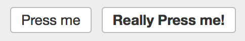

See [Button](domkit::Button) for full API details.

See also: [ToggleButton](#togglebutton), [ListButton](#listbutton)

# ButtonGroup
[ButtonGroup](domkit::ButtonGroup) groups a set of toggle or radio buttons and
handles making sure only one button in group is selected at a time.

    group := ButtonGroup
    {
      it.add(ToggleButton { ... })
      it.add(ToggleButton { ... })
      it.add(ToggleButton { ... })
    }

    group.selIndex = 1      // set group selection
    sel := group.selIndex   // get current selection

See [ButtonGroup](domkit::ButtonGroup) for full API details.

See also: [ToggleButton](#togglebutton), [RadioButton](#radiobutton)

# Checkbox
[Checkbox](domkit::Checkbox) displays a checkbox that can be toggled on and off.

    Checkbox {}
    Checkbox { it.checked = true }

On its own, only the actual checkbox is displayed.  Generally its desirable
to display a text label attached to the checkbox.  You can extend the click
target area to this label using the [wrap](domkit::Checkbox.wrap) method:

    Checkbox {}.wrap("You can click here too!")

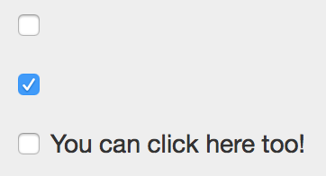

To receive callbacks when the state changes, add an
[onAction](domkit::Checkbox.onAction) event handler:

    Checkbox
    {
      it.onAction |c| { echo("checked: $c.checked") }
    }

See [Checkbox](domkit::Checkbox) for full API details.

# Combo
[Combo](domkit::Combo) combines a TextField and ListButton into a single widget
that allows a user to select from a list or manually enter a value. The
internal [TextField](domkit::TextField) component is available with
[Combo](domkit::Combo). In practice you will interact with Combo the same as
[TextField](domkit::TextField), so [Combo.field](domkit::Combo.field) is the
right place to register event callbacks such as `onModify` and `onAction`.

    Combo
    {
      it.items = ["Alpha, "Beta", "Gamma"]
      it.field.onAction |f| { echo("value: $f.val") }
    }

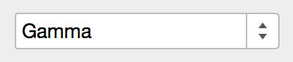

See [Combo](domkit::Combo) for full API details.

# FilePicker
[FilePicker](domkit::FilePicker) allows selection of files to upload from the
client browser.

For simple form uploads, FilePicker is backed by an `<input type="file">` so
can be enabled just by giving a name when inside a `<form>`:

    FilePicker { it->name="upload" }

To configure what file types can be selected, or to enable multiple selection:

    FilePicker
    {
      it.accept = "image/*"   // allow only images
      it.multi  = true        // allow multiple files to upload
    }

To receive callbacks when a file is selected, add an
[onSelect](domkit::FilePicker.onSelect) event handler:

    FilePicker
    {
      it.onSelect |p| { ... }
    }

The list of selected files can be introspected client-side via the
[files](domkit::FilePicker.files) field:

    // list of files
    files := picker.files

    f.name    // filename of file
    f.size    // size of file
    f.type    // MIME type of file

    // async load file contents as a text string client-side
    f.readAsText |text| { ... }

    // async load file contents and encode as a data:// URI client-side
    f.readAsDataUri |uri| { ... }

The FilePicker UI can be customized by hiding the actual FilePicker DOM element
and using the [open](domkit::FilePicker.open) method to programmatically
trigger displaying the browser's native file picker:

    picker := FilePicker { it.style->display="none" }

    button := Button
    {
      it.text = "Choose Files"
      it.onAction { picker.open }
    }

    parent.add(picker)   // make sure FilePicke is actually mounted in DOM
    parent.add(button)

See [FilePicker](domkit::FilePicker) and [DomFile](dom::DomFile) for full API
details.

# Label
[Label](domkit::Label) simply displays text content. Labels are designed to
naturally align vertically with control widgets like [Button](domkit::Button):

    Label { it.text="My Label" }

See [Label](domkit::Label) for full API details.

# ListButton
[ListButton](domkit::ListButton) allows user selection of a list item by
showing a listbox popup when a button is pressed:

    ListButton
    {
      it.items = ["Alpha", "Beta", "Gamma"]
      it.onSelect |b| { echo("Selected $b.sel.item") }
    }

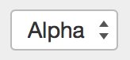

By default [ListButton](domkit::ListButton) will display items using `toStr`.
To customize how the display element is is created, use
[onElem](domkit::ListButton.onElem):

    ListButton
    {
      it.items = [1,2,3,4]
      it.onElem |v| { "Item #$v" }
    }

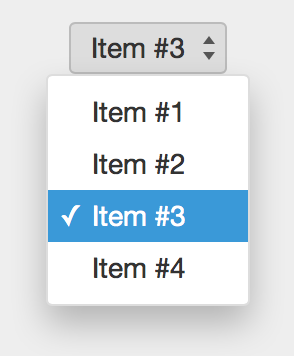

See [ListButton](domkit::ListButton) for full API details.

# Link
[Link](domkit::Link) creates an `<a>` tag for links:

      Link
      {
        it.uri  = `https://fantom.org`
        it.text = "Fantom"
      }

Use [target](domkit::Link.target) to specify a link target:

      Link
      {
        it.uri    = `https://fantom.org`
        it.text   = "Fantom"
        it.target = "_blank"
      }

See [Link](domkit::Link) for full API details.

# Menu
[Menu](domkit::Menu) displays a menu of selectable
[MenuItems](domkit::MenuItem).

    menu := Menu
    {
      MenuItem { it.text="Alpha"; it.onAction { ... } },
      MenuItem { it.text="Beta";  it.onAction { ... } },
      MenuItem { it.text="Gamma"; it.onAction { ... } },
      MenuItem { it.text="Delta"; it.onAction { ... } },
    }

    menu.open(100, 100)

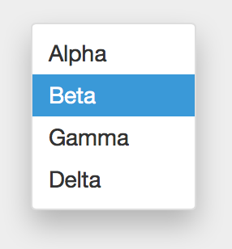

See [Menu](domkit::Menu) for full API details.

# ProgressBar
[ProgressBar](domkit::ProgressBar) visualizes progress of a long running
operation.

    ProgressBar {}

    ProgressBar
    {
      it.val = 25                     // set progress value
      it.onText |p| { "${p.val}%" }   // set bar text
    }

    ProgressBar
    {
      it.val = 75
      it.onText |p| { "${p.val}%" }
      it.onBarColor |p| { "#2ecc71" }  // set bar color
    }

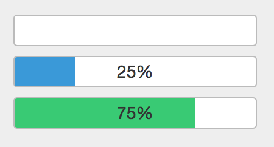

See [ProgressBar](domkit::ProgressBar) for full API details.

# RadioButton
[RadioButton](domkit::RadioButton) displays a radio button:

    RadioButton {}
    RadioButton { it.checked = true }

On its own, only the actual radio button is displayed. Generally its desirable
to display a text label attached to the radio. You can extend the click target
area to this label using the [wrap](domkit::RadioButton.wrap) method:

    RadioButton {}.wrap("You can click here too!")

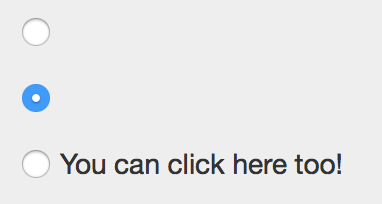

To receive callbacks when the state changes, add an
[onAction](domkit::RadioButton.onAction) event handler:

    RadioButton
    {
      it.onAction |c| { echo("checked: $c.checked") }
    }

For grouping sets of radios for exclusive selection, see
[ButtonGroup](#buttongroup).

See [RadioButton](domkit::RadioButton) for full API details.

# Table
[Table](domkit::Table) displays a grid of rows and columns.

    @Js class MyTableModel : TableModel
    {
      override Int numCols() { 100 }
      override Int numRows() { 10 }
      override Void onCell(Elem cell, Int col, Int row, TableFlags flags)
      {
        cell.text = "C$col:R$row""
      }
    }

    Table
    {
      // Note that 'rebuild' is required to display the initial
      // table, and to update the table due to any model changes

      it.model = MyTableModel()
      it.rebuild
    }

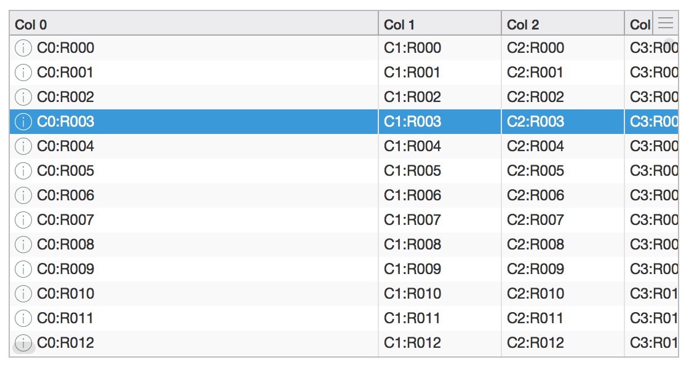

Common table operations:

    // toggle table header
    table.showHeader = false

    // sort a column
    table.sort(2, Dir.down)

    // customize zebra-striping for table rows; use empty list
    // to remove background color from all rows
    table.stripeClasses = [,]
    table.stripeClasses = ["even", "odd"]

    // enable multiple selection
    table.sel.multi = true

    // callback when selection changes
    table.onSelect |t| { echo(t.sel.index) }

    // callback when row is double-clicked; to access Selection.item
    // be sure to override TableModel.item to return backing object
    table.onAction |t| { echo(t.sel.item) }

    // callback for cell events
    table.onTableEvent("mousedown") |e| { echo(e) }

    // enable custom header popup located in top-right corner of table
    table.onHeaderPopup |t| { return Popup { ... }}

See API for full details: [Table](domkit::Table),
[TableModel](domkit::TableModel), [Selection](domkit::Selection),
[TableEvent](domkit::TableEvent)

# TextArea
[TextArea](domkit::TextArea) allows multi-line text input.

    TextArea
    {
      it.cols = 40
      it.rows = 10
      it.val = "Some text\n  Here\nAnd there"
    }

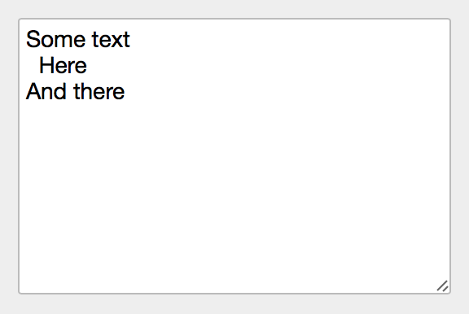

Use [onModify](domkit::TextArea.onModify) to receive callbacks when text is
modified in TextArea:

    TextArea
    {
      it.onModify |f| { echo(f.val) }
    }

See [TextArea](domkit::TextArea) for full API details.

# TextField
[TextField](domkit::TextField) allows text input.

    TextField {}
    TextField { it.val = "Hello, World" }
    TextField { it.placeholder = "Search..." }

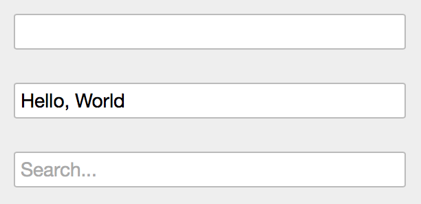

Use [onModify](domkit::TextField.onModify) to receive callbacks when text is
modified in TextField:

    TextField
    {
      it.onModify |f| { echo(f.val) }
    }

Use [onAction](domkit::TextField.onAction) to receive callbacks when the Enter
key is pressed in a TextField:

    TextField
    {
      it.onAction |f| { echo(f.val) }
    }

See [TextField](domkit::TextField) for full API details.

# ToggleButton
[ToggleButton](domkit::ToggleButton) models a boolean state toggled by pressing
a button:

    ToggleButton
    {
      it.text = "Toggle Me"
      it.onAction |b| { echo("state: $b.selected") }
    }

The content may be modified based on selected state by specifying
[elemOn](domkit::ToggleButton.elemOn) and
[elemOff](domkit::ToggleButton.elemOff):

    ToggleButton
    {
      it.elemOn  = Elem { it.text="On" }
      it.elemOff = Elem { it.text="Off" }
      it.selected = false   // make sure to set default state last
    }

You may also pass any object to `elemOn` and `elemOff` and the Elem instance
will be created using `Obj.toStr`:

    ToggleButton
    {
      it.elemOn  = "On"
      it.elemOff = "Off"
      it.selected = false
    }

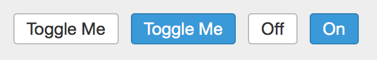

For grouping sets of toggle buttons for exclusive selection, see
[ButtonGroup](#buttongroup).

See [ToggleButton](domkit::ToggleButton) for full API details.

# Tooltip
[Tooltip](domkit::Tooltip) displays a small popup when the mouse hovers over
the bound node element, and is dismissed when the mouse moves out.

    Tooltip
    {
      it.text = "More info here!"
      it.bind(parent)
    }

See [Tooltip](domkit::Tooltip) for full API details.

# Tree
[Tree](domkit::Tree) visualizes [TreeNodes](domkit::TreeNode) as a series of
expandable nodes.

    @Js class MyTreeNode : TreeNode
    {
      new make(Obj item) { this.item = item }
      override TreeNode[] children() { ... }
      override Void onElem(Elem elem, TreeFlags flags)
      {
        elem.text = obj.toStr
      }
      private Obj obj
    }

    Tree
    {
      // Note that 'rebuild' is required to display the initial
      // tree, and to update the tree due to any model changes

      it.roots = [MyTreeNode(...), MyTreeNode(...), ...]
      it.rebuild
    }

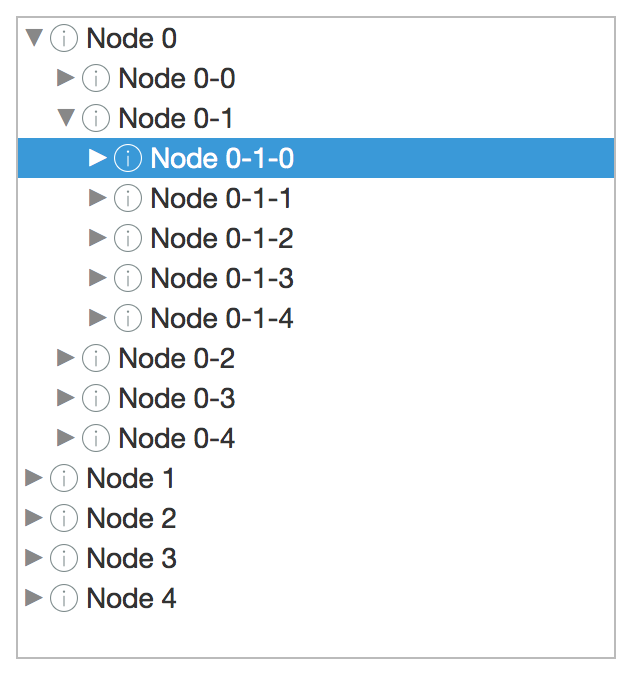

Common tree operations:

    // callback when selection changes; item is TreeNode instance
    tree.onSelect |t| { echo(t.sel.item) }

    // callback when row is double-clicked; item is TreeNode instance
    tree.onAction |t| { echo(t.sel.item) }

    // callback for node events
    tree.onTreeEvent("mousedown") |e| { echo(e) }

Note that `Selection.index` is not valid for Tree instances.

Lazily-loading tree nodes:

    @Js class LazyTreeNode : TreeNode
    {
      new make(Tree tree, Obj item)
      {
        this.tree = tree
        this.item = item
      }

      ...

      override Bool hasChildren()
      {
        // return true if kids not loaded
        kids==null ? true : kids.size > 0
      }

      override TreeNode[] children()
      {
        // return kids if already loaded
        if (kids != null) return kids

        // async load kids
        doAsyncLoad(this) |items|
        {
          this.kids = items.map |i| { LazyTreeNode(tree, i) }
          tree.refreshNode(this)
        }

        // return empty; doAsyncLoad will refresh
        return TreeNode#.emptyList
      }

      private Tree tree
      private Obj item
      private LazyTreeNode[]? kids
    }

See API for full details: [Tree](domkit::Tree),
[TreeNode](domkit::TreeNode), [Selection](domkit::Selection),
[TreeEvent](domkit::TreeEvent)
